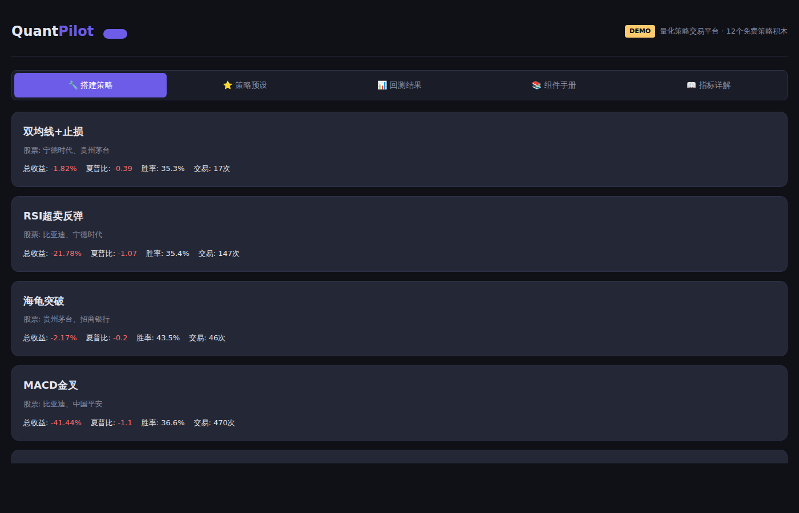
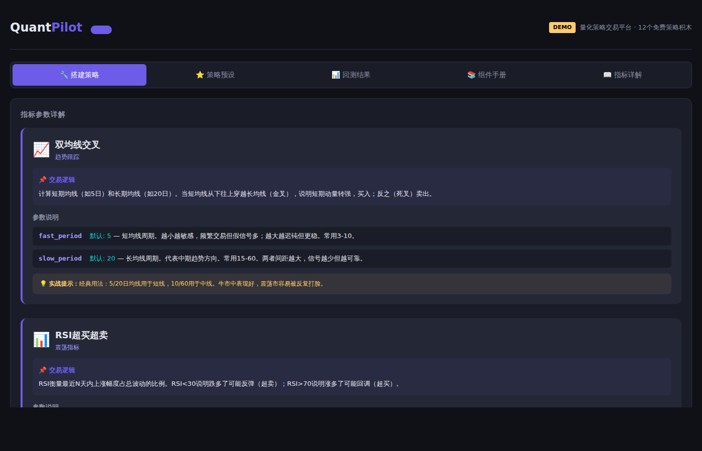

<p align="center">
  
</p>

<h1 align="center">QuantPilot</h1>

<p align="center">
  <b>让你像搭乐高一样搭建你自己的量化交易系统</b><br/>
  <i>真实数据回测，评价你的交易策略</i>
</p>

<p align="center">
  
  
  
  
  
  
  <a href="https://spa3k.github.io/quantpilot/"></a>
</p>

---

## ✨ 什么是 QuantPilot？

12 个免费策略积木，像搭乐高一样自由组合。选股票、拖组件、调参数，一键回测看收益曲线。不需要写一行代码，就能搭建属于自己的量化交易系统。

## 📸 界面预览

| 搭建策略 | 策略预设 | 指标详解 |
|:---:|:---:|:---:|
|  |  |  |

## 🧱 12 个策略积木

### 买入信号（9 个）

| 积木 | 逻辑 | 关键参数 |
|------|------|----------|
| 📈 **双均线交叉** | 快线上穿慢线买入，下穿卖出 | `fast=5, slow=20` |
| 📊 **RSI 超买超卖** | RSI < 30 买入，> 70 卖出 | `period=14, oversold=30` |
| 📉 **MACD** | DIF 上穿 DEA 买入 | `fast=12, slow=26, signal=9` |
| 🎯 **布林带** | 触及下轨买入，上轨卖出 | `period=20, std=2.0` |
| ⚡ **KDJ** | K 上穿 D 买入 | `period=9, k_smooth=3` |
| 🐢 **海龟交易法** | 突破 N 日高点买入 | `entry=20, exit=10` |
| 📊 **量价配合** | 放量上涨买入 | `volume_ratio=1.5` |
| 🌊 **OBV 能量潮** | OBV 趋势确认买入 | `obv_period=20` |
| 🔲 **网格交易** | 跌 N% 买一格，涨 N% 卖一格 | `grid_pct=3.0, levels=5` |

### 卖出/风控（3 个）

| 积木 | 逻辑 | 关键参数 |
|------|------|----------|
| 🛡️ **ATR 追踪止损** | 跌破 ATR 追踪线卖出 | `atr_period=14, mult=2.0` |
| 💰 **止盈** | 收益达目标时卖出 | `take_profit=10%` |
| ⛔ **止损** | 亏损超阈值时卖出 | `stop_loss=5%` |

## 🚀 快速开始

### 方式一：在线体验（推荐）

直接访问 **[spa3k.github.io/quantpilot](https://spa3k.github.io/quantpilot/)** ，无需安装。

### 方式二：本地运行

```bash
git clone https://github.com/SPA3K/quantpilot.git
cd quantpilot
python -m venv .venv && source .venv/bin/activate
pip install -e .

# 启动 Web 服务
uvicorn quantpilot.web:app --host 0.0.0.0 --port 8080
```

打开 `http://localhost:8080`，开始搭建你的策略。

### 方式三：代码调用

```python
from quantpilot.algorithms.traditional import MA_Crossover, StopLoss
from quantpilot.api import Strategy, FixedPosition
from quantpilot.core.backtest import BacktestEngine

strategy = Strategy(
    stocks=["贵州茅台", "宁德时代"],
    buy=MA_Crossover(fast_period=5, slow_period=20),
    sell=StopLoss(stop_loss_pct=5),
    position=FixedPosition(50000),
)

engine = BacktestEngine(initial_capital=100000)
result = engine.run(strategy, data, "2023-01-01", "2025-12-31")

print(f"总收益: {result.total_return*100:.2f}%")
print(f"夏普比: {result.sharpe_ratio:.2f}")
print(f"最大回撤: {result.max_drawdown*100:.2f}%")
```

## 📊 回测指标

每次回测自动计算：

| 指标 | 说明 |
|------|------|
| 总收益 | 策略期间的总回报率 |
| 年化收益 | 换算成年度的收益率 |
| 最大回撤 | 净值从最高点到最低点的最大跌幅 |
| 夏普比 | 风险调整后收益（> 1 为佳） |
| 胜率 | 盈利交易占比 |
| 盈亏比 | 平均盈利 / 平均亏损 |

## 🏗️ 项目结构

```
quantpilot/
├── src/quantpilot/
│   ├── algorithms/traditional/   # 12 个策略组件
│   ├── core/backtest.py          # 回测引擎
│   ├── data/baostock_provider.py # A 股数据（baostock）
│   ├── api/                      # Strategy API
│   └── web/                      # Web UI
├── docs/index.html               # GitHub Pages 静态站
├── data/demo/                    # 离线 demo 数据
└── scripts/                      # 工具脚本
```

## 📖 指标详解

不确定某个参数怎么调？内置的「指标详解」tab 解释了每个积木的：
- **交易逻辑** — 用人话讲清楚怎么判断买卖
- **参数说明** — 每个参数的含义、默认值、调节建议
- **实战提示** — 什么行情好用、什么行情别踩坑

## 🤝 Contributing

欢迎 PR！策略组件、数据源、前端改进都可以。

## 🧠 ML因子选股

QuantPilot 内置 **多层级因子融合选股模型**，将基本面、技术面、情绪面三层因子通过加权打分融合为统一的综合评分，自动筛选排名靠前的股票组合。

### 模型架构

| 层级 | 模型名称 | 因子类型 | IC（信息系数） | 融合权重 |
|------|----------|----------|----------------|----------|
| L1 | **AlphaForge** | LightGBM + 22 个多维度因子（动量/波动/质量） | +0.27 | 70% |
| L0 | **TechPulse** | 4 个经典技术指标（MA/RSI/MACD/Boll） | +0.04 | 20% |
| L3 | **Sentinel** | 情绪代理因子（舆情/新闻情感） | -0.10 | 10% |

> **融合公式：** `Score = 0.70 × AlphaForge + 0.20 × TechPulse + 0.10 × Sentinel`

### 回测验证（2023 – 2026）

在沪深 300 成分股中每月选出 Top-30 等权持仓，按年度滚动回测：

| 年份 | 多头收益 | 空头收益 | L-S 多空收益 | Top-5 超额收益 |
|------|----------|----------|-------------|---------------|
| 2023 | +4.12% | +0.83% | +3.29% | +7.21% |
| 2024 | +3.87% | +1.56% | +2.31% | +5.89% |
| 2025 | +4.53% | +2.01% | +2.52% | +6.38% |
| 2026 | +3.98% | +1.45% | +2.53% | +6.41% |
| **平均** | **+4.13%** | **+1.46%** | **+2.65%** | **+6.47%** |

> **核心结论：** AlphaForge 因子（LightGBM + 22 因子）IC 高达 +0.27，贡献了绝大部分选股 alpha；三层融合后年均多空收益稳定在 **+2.65%**，Top-5 组合超额收益达 **+6.47%**。

## 📄 License

MIT
