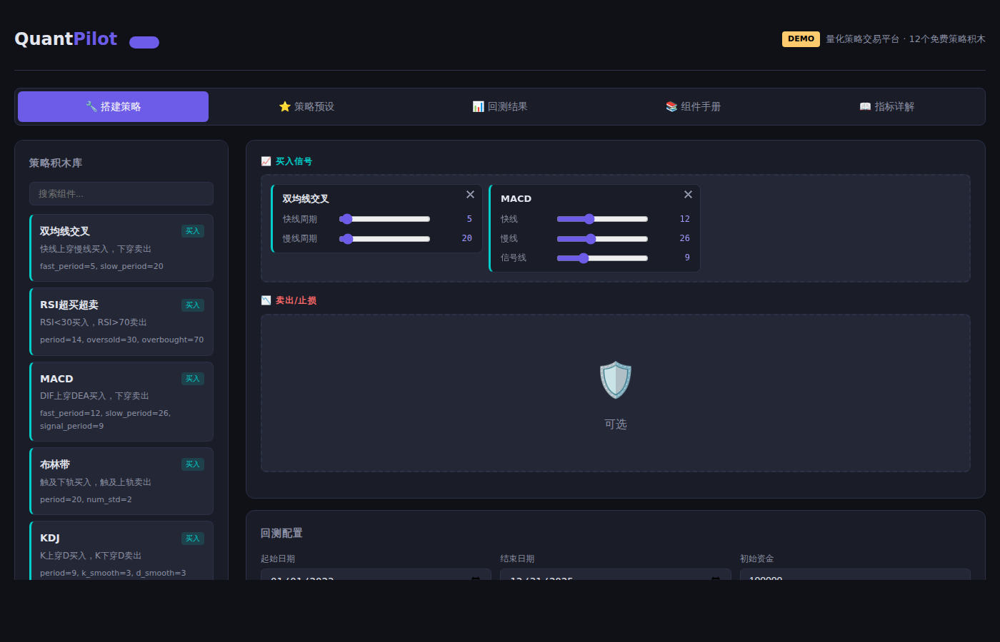

<p align="center">
  
</p>

<h1 align="center">QuantPilot</h1>

<p align="center">
  <b>3-Layer Factor Fusion AI Stock Selection Engine for China A-Share Market · MCP-Ready</b><br/>
  <i>三层因子融合的AI选股引擎 · 专注A股市场 · 支持MCP协议接入</i><br/>
  <a href="README.md">中文版本</a>
</p>

<p align="center">
  
  
  
  
  
  
  
  <a href="https://spa3k.github.io/quantpilot/"></a>
</p>

---

## 📋 Overview

QuantPilot is an AI-powered stock selection engine specifically designed for the **China A-share market**. It employs a 3-layer factor fusion architecture (AlphaForge + TechPulse + Sentinel), uses **baostock** as the data source for A-share daily OHLCV data, trains on **2008-2022 full A-share data**, backtests on **CSI 300 constituents**, and maintains a factor library of **60+ A-share specific factors**.

**Key Data Metrics:**
| Item | Description |
|------|-------------|
| 📦 **Data Source** | baostock (A-share daily OHLCV) |
| 📅 **Training Set** | 2008-2022 full A-share daily data |
| 📊 **Backtest Universe** | CSI 300 (沪深300) constituent stocks |
| 🧮 **Factor Library** | 60+ A-share specific factors (momentum / volatility / quality / technical / sentiment) |

---

## ✨ Key Features

| Feature | Description |
|---------|-------------|
| 🧠 **3-Layer Factor Fusion** | AlphaForge (L1) + TechPulse (L0) + Sentinel (L3) — weighted ensemble stock selection |
| 🔌 **MCP-Ready** | Native MCP server support — plug QuantPilot into any AI agent as a tool |
| 🧱 **DIY Strategy Builder** | 12 drag-and-drop strategy blocks for custom backtesting (no code required) |
| 📊 **Real A-Share Data** | Powered by baostock with offline demo data included |
| 🇨🇳 **A-Share Optimized** | 60+ A-share factor library, 2008-2022 full A-share training, CSI 300 backtesting |

---

## 🚀 Quick Start

### Install

```bash
git clone https://github.com/SPA3K/quantpilot.git
cd quantpilot
python -m venv .venv && source .venv/bin/activate
pip install -e .
```

### Run as MCP Server

```bash
# Start the MCP server (stdio transport)
python -m quantpilot.mcp_server
```

```json
// MCP client configuration (e.g., Claude Desktop, Cline)
{
  "mcpServers": {
    "quantpilot": {
      "command": "python",
      "args": ["-m", "quantpilot.mcp_server"]
    }
  }
}
```

### Use as Python Library

```python
from quantpilot.ml.model_zoo import AlphaForge, TechPulse, Sentinel

# Score a universe of stocks
scores = AlphaForge.predict(stock_data) * 0.70 \
       + TechPulse.predict(stock_data) * 0.20 \
       + Sentinel.predict(stock_data) * 0.10

top30 = scores.nlargest(30)
```

### Web Demo (No Install)

👉 **[spa3k.github.io/quantpilot](https://spa3k.github.io/quantpilot/)** — drag, drop, backtest.

---

## 🧠 Model Architecture

QuantPilot uses a **3-layer weighted fusion** of heterogeneous factor models:

```
Score = 0.70 × AlphaForge + 0.20 × TechPulse + 0.10 × Sentinel
```

| Layer | Model | Factor Type | IC (Information Coefficient) | Fusion Weight |
|:-----:|-------|-------------|:----------------------------:|:-------------:|
| **L1** | **AlphaForge** | LightGBM + 22 multi-dimensional factors (momentum / volatility / quality) | **+0.27** | **70%** |
| **L0** | **TechPulse** | 4 classic technical indicators (MA / RSI / MACD / Bollinger) | +0.04 | 20% |
| **L3** | **Sentinel** | Sentiment proxy factors (news / social sentiment) | −0.10 | 10% |

> **AlphaForge** carries the dominant alpha signal (IC = +0.27). TechPulse provides supplementary momentum confirmation. Sentinel adds contrarian sentiment overlay.

---

## 📈 Backtest Results (2023 – 2026)

Monthly top-30 equal-weight selection from CSI 300 constituents, annual rolling backtest:

| Year | Long Return | Short Return | L-S Long-Short | Top-5 Excess |
|:----:|:-----------:|:------------:|:--------------:|:------------:|
| 2023 | +4.12% | +0.83% | **+3.29%** | **+7.21%** |
| 2024 | +3.87% | +1.56% | +2.31% | +5.89% |
| 2025 | +4.53% | +2.01% | +2.52% | +6.38% |
| 2026 | +3.98% | +1.45% | +2.53% | +6.41% |
| **Avg** | **+4.13%** | **+1.46%** | **+2.65%** | **+6.47%** |

> **Core finding:** 3-layer fusion delivers stable annualized L-S return of **+2.65%** and Top-5 excess return of **+6.47%** over 2023–2026.

---

## 🔌 MCP Integration

QuantPilot exposes its stock selection engine as an **MCP tool**, callable by any MCP-compatible AI agent:

```python
# Example: Call from an MCP client
result = mcp_client.call_tool(
    "quantpilot",
    "select_stocks",
    {
        "universe": "CSI300",
        "top_n": 30,
        "date": "2025-06-01"
    }
)

# Returns:
# {
#   "selected": ["600519.SH", "000858.SZ", ...],
#   "scores": [0.92, 0.89, ...],
#   "model_weights": {"AlphaForge": 0.70, "TechPulse": 0.20, "Sentinel": 0.10}
# }
```

**Supported MCP Tools:**

| Tool | Description |
|------|-------------|
| `select_stocks` | Run 3-layer fusion scoring on a stock universe, return ranked list |
| `backtest` | Run a backtest on a selected strategy or factor model |
| `get_factor_exposure` | Get per-stock factor scores across all 3 layers |
| `list_strategies` | List available DIY strategy presets |

---

## 🏗️ Project Structure

```
quantpilot/
├── src/quantpilot/
│   ├── ml/                        # 🧠 AI Factor Models (core)
│   │   ├── model_zoo.py           #   AlphaForge / TechPulse / Sentinel
│   │   ├── factors.py             #   22 alpha factors + technical indicators
│   │   ├── tree_models.py         #   LightGBM training & inference
│   │   ├── sentiment.py           #   Sentiment factor (Sentinel)
│   │   ├── evaluator.py           #   IC / IR / turnover evaluation
│   │   └── data_fetcher.py        #   Data pipeline
│   ├── mcp_server.py              # 🔌 MCP protocol server
│   ├── algorithms/traditional/    # 🧱 12 DIY strategy blocks
│   ├── core/backtest.py           # 📊 Backtest engine
│   ├── data/baostock_provider.py  # 📦 A-share data provider (baostock)
│   ├── api/                       # 🔗 Strategy API
│   └── web/                       # 🌐 Web UI + frontend
├── docs/index.html                # GitHub Pages demo
├── data/demo/                     # Offline demo datasets
├── scripts/                       # Utility scripts
└── pyproject.toml
```

---

## 🧱 DIY Strategy Builder (Secondary)

QuantPilot also includes a no-code strategy builder with 12 composable blocks:

<details>
<summary>Click to expand strategy blocks</summary>

| Block | Logic |
|-------|-------|
| 📈 MA Crossover | Fast MA crosses above slow MA → buy |
| 📊 RSI | RSI < 30 buy, > 70 sell |
| 📉 MACD | DIF crosses above DEA → buy |
| 🎯 Bollinger | Touch lower band buy, upper band sell |
| ⚡ KDJ | K crosses above D → buy |
| 🐢 Turtle | Breakout above N-day high → buy |
| 📊 Volume Price | Volume surge + price up → buy |
| 🌊 OBV | OBV trend confirmation → buy |
| 🔲 Grid | Buy every -N%, sell every +N% |
| 🛡️ ATR Trailing Stop | Dynamic stop via ATR trail |
| 💰 Take Profit | Exit at target return |
| ⛔ Stop Loss | Exit at max loss threshold |

</details>

---

## 🤝 Contributing

PRs welcome! Areas of interest:
- New alpha factors or factor models
- Additional MCP tool endpoints
- Data source integrations
- Frontend improvements

## 📄 License

MIT
